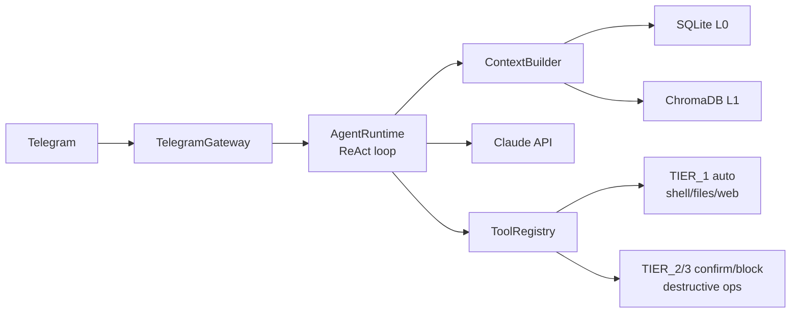

# Emergent


A personal, local-first autonomous agent powered by Claude API. Accessible via Telegram, it can execute shell commands, manage files, browse the web, monitor your system, and remember context across conversations — all with deterministic safety guardrails.

## Features

- **No-framework agent loop** — Custom ReAct pattern using Claude's native `tool_use`, ~100 lines of core logic
- **Three-tier safety classifier** — Deterministic regex-based rules (never an LLM call) prevent prompt injection
- **Persistent memory** — SQLite (conversation history, traces) + ChromaDB (semantic search) + session summaries
- **Proactive cron jobs** — Schedule tasks that run autonomously and notify you via Telegram
- **Telegram interface** — Inline keyboard confirmations for sensitive operations
- **Full observability** — Structured JSON logs with trace IDs, token counts, latency, and cost per request
- **Local-first** — All data stays on your machine

## Architecture



## Safety Tiers

All tool calls are classified **before** execution using deterministic regex rules:

| Tier | Behavior | Examples |
|------|----------|---------|
| `TIER_1_AUTO` | Execute immediately | `ls`, `cat`, `curl GET`, `df -h` |
| `TIER_2_CONFIRM` | Send Telegram inline keyboard, wait up to 60s | `rm`, `mv`, `pip install`, `git push` |
| `TIER_3_BLOCKED` | Always rejected, no override possible | `rm -rf /`, `:(){ :|:& };:`, `chmod 777 /` |

The classifier never calls the LLM — this prevents prompt injection from bypassing safety controls.

## Memory Layers

```
L0  SQLite WAL ──────── conversations, traces, user_profile, session_summaries, cron_jobs
L1  ChromaDB ─────────── semantic embeddings (all-MiniLM-L6-v2, local ONNX)
L2  Context window ───── profile text + top-k memories + session summary + recent history
```

Each conversation turn is persisted to L0 and indexed into L1. Sessions survive restarts. Auto-summarized with Haiku when history exceeds the context budget.

## Tools

| Tool | Tier | Description |
|------|------|-------------|
| `shell_execute` | TIER_1/2/3 | Run shell commands (classified per command) |
| `file_read` | TIER_1 | Read file contents |
| `file_write` | TIER_2 | Write or create files |
| `web_fetch` | TIER_1 | Fetch URLs (SSRF-protected, private IPs blocked) |
| `system_info` | TIER_1 | CPU, memory, disk metrics |
| `memory_search` | TIER_1 | Semantic search over past conversations |
| `memory_store` | TIER_1 | Store a fact in long-term memory |
| `cron_schedule` | TIER_2 | Schedule recurring tasks (persistent across restarts) |

## Hardcoded Guards

These values are verified at startup by `verify_guards_integrity()`. The agent cannot override them:

| Guard | Value | Purpose |
|-------|-------|---------|
| `MAX_ITERATIONS` | 15 | Prevent infinite loops |
| `MAX_TOKENS_SESSION` | 100,000 | Cap per-session cost |
| `TIMEOUT_PER_TOOL` | 30s | Prevent hanging tools |
| `TIMEOUT_SESSION` | 300s | Total session timeout |
| `MAX_TOOL_OUTPUT_CHARS` | 10,000 | Prevent context flooding |
| `CONFIRMATION_TIMEOUT` | 60s | TIER_2 keyboard expires |

## Installation

### Prerequisites

- Python 3.12+
- [uv](https://docs.astral.sh/uv/) package manager
- Anthropic API key
- Telegram bot token (from [@BotFather](https://t.me/botfather))

### Setup

```bash
git clone <repo-url> emergent
cd emergent

# Install as a global command
uv tool install .

# Configure credentials
cp .env.example .env
```

Edit `.env`:
```env
ANTHROPIC_API_KEY=sk-ant-...
TELEGRAM_BOT_TOKEN=123456:ABC-...
TELEGRAM_ALLOWED_USER_IDS=123456789   # your Telegram user ID
```

Get your Telegram user ID by messaging [@userinfobot](https://t.me/userinfobot).

### Optional configuration (`config.yaml`)

```yaml
agent:
  model: claude-sonnet-4-20250514
  haiku_model: claude-haiku-4-5-20251001
  max_tokens: 4096
  data_dir: ./data

system_prompt: |
  You are Emergent, a personal autonomous agent...

observability:
  log_level: INFO
  log_format: console        # 'json' for production
  # log_file: ./data/emergent.log   # enables log rotation (10MB × 5 files)
```

## Quick Start

```bash
# Run the agent (from the project directory)
cd /path/to/emergent
emergent

# Run tests
make test

# View observability dashboard
make dashboard

# View weekly triage report
make triage
```

The startup banner confirms all systems are ready:

```
 ███████╗███╗   ███╗███████╗██████╗  ██████╗ ███████╗███╗   ██╗████████╗
 ...

  v0.1.0  ·  claude-sonnet-4-20250514  ·  local-first autonomous agent

  ●  SQLite WAL      ./data/emergent.db
  ●  ChromaDB        ./data/chroma
  ●  Telegram        polling  ·  1 user authorized
  ●  Scheduler       4 jobs loaded

────────────────────────────────────────────────────────────────────────
```

Send `/start` in Telegram to begin.

## Usage Examples

**Read a file:**
> "Leé el contenido de ~/Documents/notes.txt"

**System info:**
> "¿Cuánta memoria RAM tengo disponible?"

**Web research:**
> "Buscá el precio del dólar blue hoy"

**File write (requires confirmation):**
> "Creá un archivo ~/todo.txt con mis tareas de hoy"
> *(Telegram inline keyboard appears: ✅ Ejecutar / ❌ Cancelar)*

**Blocked command:**
> "Ejecutá rm -rf /"
> *(Returns: BLOQUEADO: Este comando está bloqueado por seguridad.)*

**Schedule a proactive task:**
> "Avisame todos los días a las 9am si el disco está por encima del 80%"
> *(Creates a persistent cron job — survives restarts, notifies via Telegram)*

**Memory:**
> "Recordá que prefiero Python sobre JavaScript"
> *(Stored in ChromaDB, retrieved in future sessions)*

## Running as a System Service

To run Emergent automatically on boot and restart on crash:

```bash
# Copy and install the service
sudo cp emergent.service /etc/systemd/system/
sudo systemctl daemon-reload
sudo systemctl enable --now emergent

# Check status and follow logs
systemctl status emergent
journalctl -u emergent -f
```

To stop or restart:
```bash
sudo systemctl stop emergent
sudo systemctl restart emergent
```

Edit `emergent.service` to adjust `User` and `WorkingDirectory` to match your setup before installing.

## Updating

After pulling new code, reinstall the global command:

```bash
git pull
uv tool install . --reinstall
```

## Project Structure

```
emergent/
├── src/emergent/
│   ├── __init__.py          # Exception hierarchy
│   ├── __main__.py          # Entrypoint, wires all components
│   ├── config.py            # pydantic-settings + dataclasses
│   ├── agent/
│   │   ├── runtime.py       # Core ReAct loop (retry + guards)
│   │   ├── prompts.py       # System prompt builder
│   │   └── context.py       # Context window manager
│   ├── tools/
│   │   ├── registry.py      # Safety classifier + ToolRegistry
│   │   ├── shell.py         # Shell execution
│   │   ├── files.py         # File read/write
│   │   ├── web.py           # Web fetch (SSRF protection)
│   │   ├── system_info.py   # System metrics
│   │   ├── cron.py          # APScheduler (SQLite-persistent)
│   │   └── memory_tools.py  # memory_search / memory_store
│   ├── memory/
│   │   ├── store.py         # SQLite WAL (L0)
│   │   ├── retriever.py     # ChromaDB (L1)
│   │   └── summarizer.py    # Haiku-based auto-summarization
│   ├── channels/
│   │   └── telegram.py      # aiogram v3 gateway
│   └── observability/
│       ├── banner.py        # Startup banner (Rich)
│       ├── tracing.py       # structlog JSON + log rotation
│       └── metrics.py       # Dashboard + triage CLI
├── tests/
│   ├── test_e2e/
│   │   └── test_agent_loop.py  # 7 E2E integration tests
│   ├── test_tools/
│   │   ├── test_registry.py    # 54 safety classifier tests
│   │   ├── test_security.py    # 16 red team tests
│   │   ├── test_files.py       # 10 file tool tests
│   │   └── test_shell.py       # 8 shell tool tests
│   └── test_memory/
│       └── test_store.py       # 10 SQLite persistence tests
├── emergent.service         # systemd unit file
├── config.yaml
├── .env.example
├── pyproject.toml
└── Makefile
```

## Observability

Every LLM call and tool execution is logged as structured JSON:

```json
{"event": "llm_call_done", "iteration": 1, "stop_reason": "tool_use",
 "input_tokens": 1823, "output_tokens": 45, "cost_usd": 0.000682,
 "duration_ms": 1240, "trace_id": "abc123", "session_id": "xyz789"}
```

Run the dashboard:
```bash
make dashboard
```

```
============================================================
  EMERGENT — OBSERVABILITY DASHBOARD
============================================================

📊 REQUEST VOLUME
  24h :   12 requests | 100.0% success ✅
   7d :   84 requests |  97.6% success ✅

⚡ LATENCY (last 24h)
  p50:   3.2s ✅   p95:  18.7s ✅

💰 COST
  24h : $0.0182 total | $0.0015 avg/req ✅
```

## Troubleshooting

### `TelegramConflictError: Conflict: terminated by other getUpdates request`

Another instance is still running. Kill all instances and restart:
```bash
pkill -f "emergent" && sleep 2 && emergent
```

### ChromaDB model download on first startup

Normal — downloads the `all-MiniLM-L6-v2` ONNX model (~80MB) to `~/.cache/chroma/`. One-time only.

### `ValidationError: ANTHROPIC_API_KEY` missing

The `.env` file must be in the directory where you run `emergent`:
```bash
cd /path/to/emergent
emergent
```

### Bot not responding to messages

Verify your user ID is in `TELEGRAM_ALLOWED_USER_IDS`. Check logs for `auth_denied` events:
```bash
journalctl -u emergent | grep auth_denied
```

### Cron jobs disappear after restart

This should not happen — cron jobs are persisted in SQLite via APScheduler's `SQLAlchemyJobStore`. If it does, check that the scheduler is using the same `data_dir` as configured in `config.yaml`.

## Security Notes

- **Whitelist-only access**: Only Telegram user IDs in `TELEGRAM_ALLOWED_USER_IDS` can interact with the agent
- **No LLM in safety path**: Safety classification is pure regex — the agent cannot talk its way out of TIER_3 blocks
- **Secret detection**: Patterns for API keys, tokens, and credentials prevent secrets from being stored in memory
- **SSRF protection**: `web_fetch` blocks requests to private IP ranges (10.x, 172.16-31.x, 192.168.x, 127.x, 169.254.x)
- **Path traversal protection**: `file_read` and `file_write` reject `../` sequences and sensitive files (`.env`, `.ssh`, `.pem`)
- **Atomic file writes**: `file_write` with `mode=create` uses `open(path, 'x')` — no race conditions

## License

MIT
