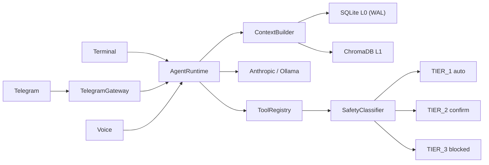

# Emergent


A personal, local-first autonomous agent with deterministic safety guardrails.

Emergent runs the same runtime across multiple channels:
- Terminal chat (always available)
- Telegram bot (optional)
- Push-to-talk voice (optional)

It can execute shell commands, manage files, browse the web, inspect system state, schedule cron jobs, and persist memory across sessions.

## Features

- **No-framework agent loop**: custom ReAct-style runtime using native `tool_use`
- **Deterministic safety classifier**: regex-based tiering before every tool call (no LLM in safety path)
- **Multi-channel UX**: terminal + Telegram + optional voice channel
- **Provider flexibility**: Anthropic and Ollama support for both runtime and summarization
- **Persistent memory**: SQLite (WAL) + ChromaDB + session summaries
- **Proactive cron jobs**: persistent scheduler backed by SQLite
- **Structured observability**: JSON logs with trace IDs, latency, token, and cost signals

## Architecture


```mermaid
flowchart LR
  Terminal --> AgentRuntime
  Telegram --> TelegramGateway --> AgentRuntime
  Voice --> AgentRuntime
  AgentRuntime --> ContextBuilder
  AgentRuntime --> LLMProvider["Anthropic / Ollama"]
  AgentRuntime --> ToolRegistry
  ContextBuilder --> SQLite["SQLite L0 (WAL)"]
  ContextBuilder --> ChromaDB["ChromaDB L1"]
  ToolRegistry --> SafetyClassifier
  SafetyClassifier --> Tier1["TIER_1 auto"]
  SafetyClassifier --> Tier2["TIER_2 confirm"]
  SafetyClassifier --> Tier3["TIER_3 blocked"]
```

## Safety Tiers

All tool calls are classified **before execution** with deterministic rules.

| Tier | Behavior | Examples |
|------|----------|----------|
| `TIER_1_AUTO` | Execute immediately | `ls`, `df -h`, `curl GET`, file reads |
| `TIER_2_CONFIRM` | Require explicit confirmation (60s timeout) | `rm`, `mv`, package install, file write/delete |
| `TIER_3_BLOCKED` | Always rejected | `rm -rf /`, fork bombs, `chmod 777 /` |

The classifier never calls an LLM, which prevents prompt injection from bypassing guardrails.

## Memory Layers

```
L0  SQLite WAL  -------- conversations, traces, profile, summaries, cron jobs
L1  ChromaDB    -------- semantic embeddings for retrieval
L2  Context win -------- profile + top-k memories + summary + recent turns
```

Conversations survive restarts. When history grows too large, Emergent auto-summarizes and keeps the latest turns.

## Tools

| Tool | Tier | Description |
|------|------|-------------|
| `shell_execute` | dynamic | Run shell commands (tier decided per command) |
| `file_read` | TIER_1 | Read a file |
| `file_write` | TIER_2 | Write/create a file |
| `list_directory` | TIER_1 | List directory entries |
| `directory_tree` | TIER_1 | Render recursive tree |
| `search_files` | TIER_1 | Search paths by pattern |
| `search_in_files` | TIER_1 | Search text across files |
| `file_info` | TIER_1 | Stat/metadata for a path |
| `file_move` | TIER_2 | Move/rename files |
| `file_delete` | TIER_2 | Delete file/directory |
| `web_fetch` | TIER_1 | Fetch URLs (SSRF-protected) |
| `system_info` | TIER_1 | CPU, memory, disk metrics |
| `memory_search` | TIER_1 | Semantic memory lookup |
| `memory_store` | TIER_1 | Store long-term facts |
| `cron_schedule` | TIER_2 | Schedule persistent recurring tasks |

## Hardcoded Guards

These values are verified at startup and are not user-modifiable at runtime.

| Guard | Value |
|-------|-------|
| `MAX_ITERATIONS` | 15 |
| `MAX_TOKENS_SESSION` | 100,000 |
| `TIMEOUT_PER_TOOL_SECONDS` | 30 |
| `TIMEOUT_SESSION_SECONDS` | 300 |
| `MAX_TOOL_OUTPUT_CHARS` | 10,000 |
| `CONFIRMATION_TIMEOUT_SECONDS` | 60 |

## Installation

### Prerequisites

- Python 3.12+
- [uv](https://docs.astral.sh/uv/)
- One LLM provider:
  - Anthropic API key, or
  - local Ollama server
- Optional for Telegram channel: bot token + allowed user IDs
- Optional for voice channel: local audio stack + push-to-talk key setup

### Setup

```bash
git clone <repo-url> emergent
cd emergent
uv tool install .
cp .env.example .env
```

Edit `.env`:

```env
ANTHROPIC_API_KEY=sk-ant-...
TELEGRAM_BOT_TOKEN=123456:ABC-...            # optional
TELEGRAM_ALLOWED_USER_IDS=123456789          # optional

# Optional overrides
# EMERGENT_PROVIDER=anthropic                # anthropic | ollama
# EMERGENT_MODEL=claude-sonnet-4-20250514
# EMERGENT_HAIKU_MODEL=claude-haiku-4-5-20251001
# EMERGENT_SUMMARY_PROVIDER=ollama
# EMERGENT_OLLAMA_BASE_URL=http://127.0.0.1:11434
# EMERGENT_DATA_DIR=./data
```

If you use Telegram, get your user ID from [@userinfobot](https://t.me/userinfobot).

## Quick Start

```bash
# Start Emergent (terminal channel is always enabled)
emergent

# Fast test suite (unit + integration, skips e2e/expensive)
make test

# Security suite
make test-security

# Live E2E (requires configured provider credentials)
make test-e2e

# Lint and format
make lint
make format

# Type check
make typecheck
```

At startup, the banner shows enabled channels, database paths, scheduler jobs, and log file.

## Channel Modes

### Terminal (default)

Run `emergent` and start chatting immediately in the terminal.

### Telegram (optional)

Set `TELEGRAM_BOT_TOKEN` and `TELEGRAM_ALLOWED_USER_IDS` in `.env`.
When set, Emergent starts Telegram polling in parallel with terminal mode.

### Voice push-to-talk (optional)

Enable in `config.yaml`:

```yaml
voice:
  enabled: true
  ptt_key: "f24"
  stt_model: "small"
  stt_language: "es"
  tts_enabled: false
```

Voice input uses local `faster-whisper` transcription and can optionally synthesize responses via Piper.

## Testing Pyramid

- **Unit**: deterministic logic, fast, offline
- **Integration**: runtime and tool contracts, mostly mocked externals
- **E2E**: live provider smoke tests for critical user journeys

Commands:

```bash
make test
make test-unit
make test-integration
make test-e2e
make test-security
```

## Running as a System Service

```bash
sudo cp emergent.service /etc/systemd/system/
sudo systemctl daemon-reload
sudo systemctl enable --now emergent

systemctl status emergent
journalctl -u emergent -f
```

## Updating

```bash
git pull --ff-only
uv tool install . --reinstall
```

## Project Structure

```text
emergent/
├── src/emergent/
│   ├── __init__.py          # EmergentError base exception hierarchy
│   ├── __main__.py          # entry point, wires all components
│   ├── config.py            # settings loading (.env + config.yaml)
│   ├── agent/
│   │   ├── context.py       # ContextBuilder — token-budgeted context assembly
│   │   ├── prompts.py       # system prompt builders
│   │   └── runtime.py       # AgentRuntime — core ReAct loop
│   ├── channels/
│   │   ├── terminal.py      # rich interactive REPL
│   │   └── telegram.py      # aiogram v3 polling gateway
│   ├── llm/
│   │   ├── client.py        # LLMClient protocol (provider-agnostic)
│   │   ├── models.py        # LLMResponse, LLMUsage dataclasses
│   │   ├── factory.py       # create_llm_client() factory
│   │   ├── anthropic_client.py
│   │   └── ollama_client.py
│   ├── tools/
│   │   ├── registry.py      # ToolDefinition, ToolRegistry, SafetyTier
│   │   ├── shell.py         # shell_execute + safety classifier
│   │   ├── files.py         # 8 file tools
│   │   ├── web.py           # web_fetch (SSRF-protected)
│   │   ├── system_info.py
│   │   ├── memory_tools.py
│   │   └── cron.py
│   ├── memory/
│   │   ├── store.py         # SQLite WAL CRUD
│   │   ├── retriever.py     # ChromaDB semantic retrieval
│   │   └── summarizer.py    # auto-summarization (Haiku)
│   └── observability/
│       ├── tracing.py       # trace spans, structured logging
│       ├── banner.py        # startup banner
│       └── metrics.py       # dashboard and triage CLI views
├── tests/
├── config.yaml
├── .env.example
├── emergent.service
├── Makefile
└── pyproject.toml
```

## Observability

Emergent writes structured JSON logs to `data/logs/emergent.log` by default.
Use these commands for quick operational views:

```bash
make dashboard
make triage
```

## Troubleshooting

### Telegram conflict (`getUpdates` already running)

```bash
pkill -f "emergent" && sleep 2 && emergent
```

### Missing Anthropic key error

If `provider=anthropic`, set `ANTHROPIC_API_KEY` in `.env`.
If you want local mode, set `EMERGENT_PROVIDER=ollama` and run Ollama.

### Telegram bot does not answer

Verify your Telegram user ID is in `TELEGRAM_ALLOWED_USER_IDS` and check logs for `auth_denied`.

### Voice does not trigger

Check `voice.enabled: true`, confirm your `ptt_key`/`ptt_scan_code`, and verify local audio permissions.

## Security Notes

- Whitelist-only Telegram access via `TELEGRAM_ALLOWED_USER_IDS`
- Deterministic safety classifier before every tool execution
- Secret-pattern filtering to avoid storing credentials in memory
- SSRF protection blocks private/local address ranges
- Path traversal and sensitive path protections in file tools
- SQLite runs in WAL mode for safer concurrent persistence

## License

MIT
