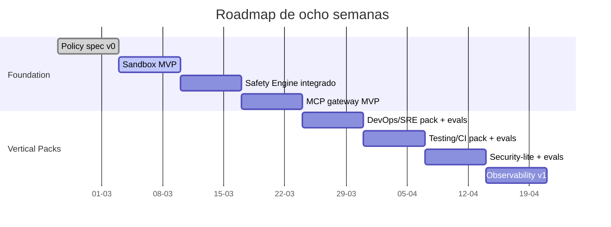
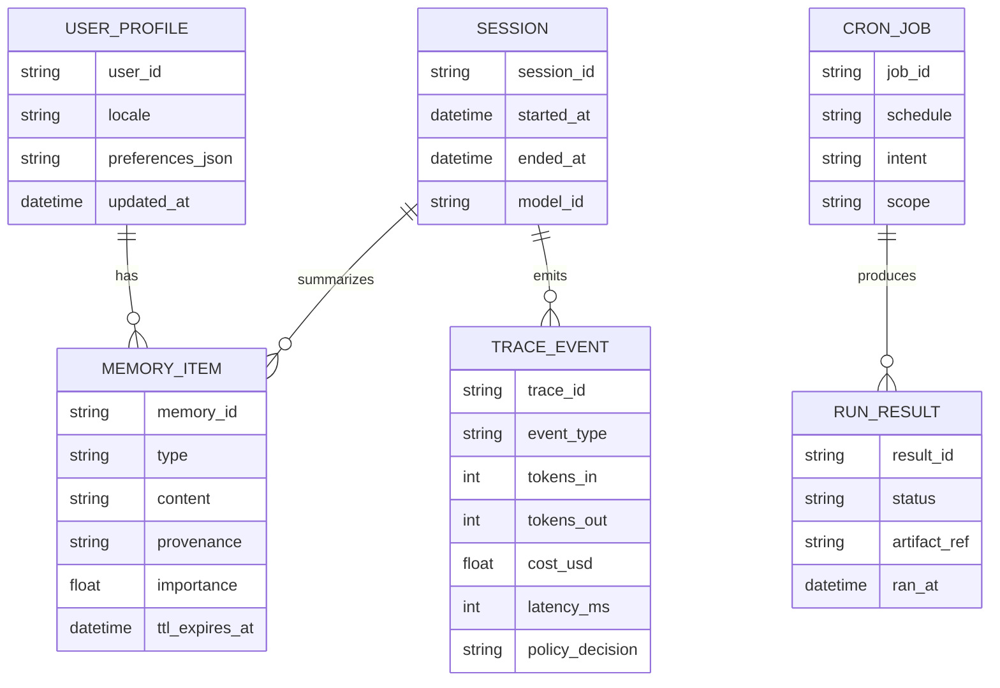
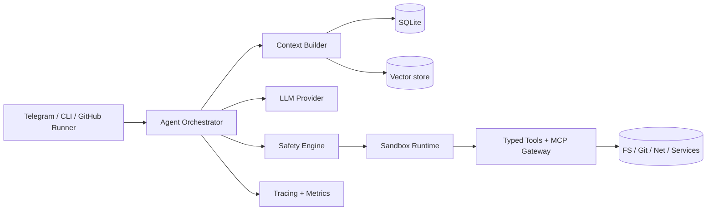
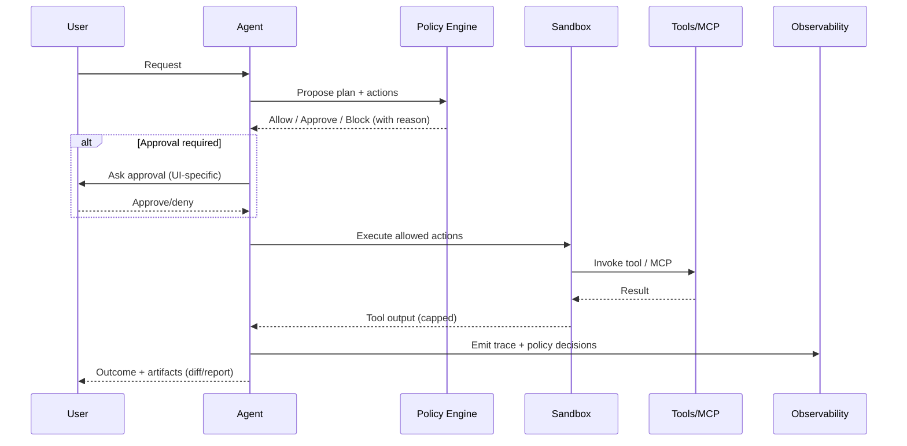

# Verticales y agentes SOTA para evolucionar Emergent

## Executive summary

Tu agente **Emergent** ya está sorprendentemente bien orientado para producción “single‑operator”: loop simple tipo ReAct, **guardrails determinísticos** (no LLM), **memoria persistente** (SQLite + Chroma) y **observabilidad** desde el día cero (trazas/costo/latencia), además de un canal de aprobación humano (Telegram). Eso lo diferencia del 90% del “vibe agent” que vive solo en prompts. citeturn23view0

El mercado SOTA de agentes de terminal/IDE (Codex CLI, Claude Code, Cursor CLI, OpenCode, Gemini CLI, Warp/Oz) está convergiendo en 5 patrones prácticos:

1) **MCP como estándar de extensibilidad**: ya no se “conecta” herramienta a herramienta; se enchufa un servidor MCP y listo. MCP tiene spec/SDKs y repos oficiales, y se está institucionalizando (Linux Foundation / Agentic AI Foundation). citeturn29search0turn29search2turn29search27  
2) **Sandboxes reales + approvals inteligentes**: regex sobre comandos no escala; los líderes pasan a aislamiento OS‑level (Seatbelt/Landlock/seccomp/WSL2) y piden aprobación solo al “salir” del sandbox. citeturn12view0turn16view4  
3) **Configuración jerárquica y “policy as config”** (deny/allow, scopes, managed settings) para controlar agency y superficie de ataque en orgs. citeturn10view2turn12view0  
4) **Instrucciones versionadas en repo** (CLAUDE.md / AGENTS.md) para que el agente se alinee al “taste” del proyecto, no al prompt del día. citeturn10view0turn7search0turn7search12  
5) **Evaluación reproducible**: benchmarks con harness y tests (SWE‑bench Verified, Terminal‑Bench) porque sin eso no podés iterar con rigor. citeturn7search9turn7search2turn7search18

Recomendación principal: **no intentes “generalista total”**. Diseñá Emergent como **núcleo generalista con agency mínima** + **verticales empaquetadas** (skills/tools/policies/evals) para DevOps/SRE y Developer Productivity primero, y luego Security/InfraSec y Testing/CI. La clave no es “más tools”, sino **mejor boundary** (sandbox + policy engine) y **mejor loop de mejora** (eval harness + métricas). (Supuestos y roadmap abajo.)

## Supuestos y definiciones operativas

**Supuestos no especificados (y por qué importan):**
- **Entorno objetivo**: parece “local‑first en tu máquina” (Python + systemd opcional) y UI por Telegram; no está explícito si apuntás a Linux/macOS/WSL en producción personal o a servidores. Esto cambia radicalmente el diseño de sandbox y credenciales. citeturn23view0  
- **Modelos**: Emergent está “powered by Claude API” y el `config.yaml` sugiere modelos tipo `claude-sonnet-4-...` y un modelo “haiku” para auto‑summaries. Si en el futuro querés multi‑model, el policy engine debe ser agnóstico del vendor. citeturn23view0  
- **Nivel de autonomía permitido**: hoy lo resolvés con tiers (auto/confirm/block) y timeout de confirmación en Telegram. En verticales enterprise (CI/CD, SecOps) esto se vuelve “policy as code + audit trail” (tipo Harness). citeturn23view0turn26view2

**Definición útil de “vertical” para agentes (pragmática):**  
Un *paquete* (1) jobs-to-be-done acotados, (2) herramientas mínimas y tipadas, (3) permisos/guardrails específicos, (4) dataset y métricas para evaluar, (5) UX de approvals adecuada al riesgo.

**Definición de threat model (para lo que estás construyendo):**  
Input no confiable (chat/PR/issues/web), herramientas con side‑effects (shell/git/red), secretos, memoria persistente que puede ser envenenada, y supply chain (dependencias/extensiones). Los incidentes recientes alrededor de agentes (prompt injection + supply chain) muestran que “approval fatigue + CI agentes sin límites” termina mal. citeturn22search1turn22search4turn6search6turn6search3

## Agentes SOTA y qué aportan

La siguiente tabla resume agentes relevantes y sus “aportes transferibles” a Emergent (más allá del hype). Donde el proveedor ofrece docs oficiales, priorizo eso.

| Agente | Qué hace (1 línea) | Modelo de negocio / licencia | Integraciones clave | Safety-by-design (lo importante) | Observabilidad / memoria |
|---|---|---|---|---|---|
| OpenClaw | Asistente personal multi‑canal (WhatsApp/Telegram/Slack/etc.) con gateway local y pairing | OSS MIT; usa suscripciones OAuth (Anthropic/OpenAI) según README | Multi‑canal + “skills”; enfoque “Gateway = control plane” | Default **DM pairing** + allowlist; guía de seguridad para DMs; daemon persistente | Orientado a always‑on; seguridad de canal destacada citeturn9view0 |
| Claude Desktop / Claude Code | Cliente desktop y agente de coding en terminal/IDE/CI; soporta MCP, hooks, subagents | Producto comercial; docs indican que desktop app requiere suscripción paga | MCP, slash commands, hooks; GitHub Actions / GitLab CI | Permisos configurables + scopes (managed/user/project/local); reglas para Bash/WebFetch/MCP; advierte fragilidad al intentar restringir URLs vía patrones en Bash | “Project memory” via CLAUDE.md; configuración jerárquica citeturn10view0turn10view1turn10view2turn5search10 |
| OpenCode | Agente OSS multi‑cliente (TUI/CLI/web/IDE) + GitHub App (corre en runner) | OSS; docs incluyen “Enterprise” | GitHub/GitLab, MCP, custom tools, OpenAPI para server | “Permissions” config (allow/prompt/block); integra AGENTS.md como reglas | Server + SDK; arquitectura cliente‑servidor; sesiones citeturn18view0turn18view1turn19search0turn19search4turn19search5 |
| Aider | Pair programming en terminal con mapa del codebase; corre tests/linters automáticamente | OSS Apache‑2.0 | Git, “map” del repo; soporta muchos modelos | Seguridad más “humana” (git diffs/commits) que sandbox; fuerte en loop “edit → test → fix” | Tiene benchmark/infra propia; orientado a iteración citeturn17view0 |
| Cursor CLI / Agent | Agente en terminal con MCP, shell mode y sandboxing cross‑platform | Comercial | MCP (mcp.json), headless/CI, GitHub Actions | Por defecto **requiere aprobación** para terminal; introduce sandbox para reducir interrupciones y approval fatigue | Sandbox explicado (Seatbelt/Landlock/WSL2) y “teach agents” para usarlo citeturn15search4turn15search1turn16view4 |
| Codex CLI | Agente terminal con **sandbox OS‑level + approvals** y OTel opcional | Producto de OpenAI (ecosistema Codex/ChatGPT); docs oficiales | MCP (stdio/http, OAuth), IDE extension | Sandboxing (Seatbelt/Landlock/seccomp); policies (read‑only / workspace‑write); approvals por request; OTel opt‑in | Eventos estructurados si habilitás OTel; config.toml profiles citeturn12view0turn12view2 |
| Warp Agents / Oz | “Agentic dev environment” (terminal + orquestación cloud) | Comercial | Integraciones, triggers, cloud agents | Promete permisos granulares + full terminal use (en docs) | Orquestación + auditoría/visibilidad de runs citeturn20view1turn20view2 |
| Gemini CLI | Agente OSS para terminal con herramientas built‑in y MCP; tier gratuito alto | OSS Apache‑2.0; free tier con cuenta Google | Google Search grounding, file ops, shell, web fetch, MCP, slash commands | Enfoque “terminal-first”; extensible vía MCP | Repos incluye evals/integration tests; slash commands en .toml/MCP citeturn21view0turn21view2 |
| Harness AI Agents (pipeline-native) | Agentes que corren **dentro de pipelines** (build/test/deploy/sec/finops) | Comercial (plataforma) | MCP server oficial; integra con múltiples clientes | Policy-first: heredan RBAC/secrets/OPA gates; allow‑listed tools; audit y reasoning en logs | “Pipeline como harness de ejecución” + observabilidad/auditoría citeturn26view2turn26view0turn25view4 |
| GitHub Copilot CLI | Copilot en terminal; integración con `gh copilot` | Comercial (GitHub) | CLI vía GitHub CLI; tareas típicas de terminal | (Depende del modo) pero el vector clave es que baja/ejecuta tooling en entorno del dev | Distribución vía `gh`; útil para “developer productivity” citeturn30view0turn31view0 |
| Continue (checks en PR) | “AI checks” source‑controlled corriendo en PRs como status checks | OSS (repos público) + oferta comercial | PR checks con agentes definidos en markdown | Reduce riesgo: output como check/diff; humano decide | Muy alineado a “standards enforcement” citeturn22search15turn22search2 |

**Lectura crítica (lo que sí importa):**
- El salto cualitativo no es “más prompts”, es **aislamiento + permisos + evaluación**. Codex CLI y Cursor muestran el camino: sandboxes OS‑level y approvals “por frontera” (salir del workspace, red, paths sensibles). citeturn12view0turn16view4  
- Harness muestra el camino enterprise: el pipeline (con RBAC/OPA/audit) es el “harness” que limita agency. Esto es extremadamente transferible si algún día querés que Emergent opere sobre infra real con credenciales. citeturn26view2turn26view0  
- Claude Code aporta dos build patterns valiosos: scopes jerárquicos (managed settings) y “no confíes en Bash patterns para seguridad de red”; si Emergent se queda en regex, vas a chocar con lo mismo. citeturn10view1turn10view2

## Verticales con jobs-to-be-done, métricas y guardrails

A continuación, verticales pedidas con **máx 10 JTBD** cada una, con métricas y guardrails diseñados para producción (no demos).

### DevOps/SRE

**Jobs-to-be-done (concretos):** detectar regresiones en logs; explicar fallas de deploy/build; generar runbooks; ejecutar “health checks” locales; preparar cambios (diff/config) y abrir PR; automatizar tareas recurrentes (cron); comparar configs entre entornos; proponer rollback/mitigación; recopilar evidencia post-mortem; generar resúmenes de pipelines/infra. (Harness muestra casos tipo “error analyzer”, “pipeline summarizer”, generación de políticas). citeturn25view1turn26view2turn23view0

**Métricas de éxito:** MTTR reducido (proxy: tiempo hasta diagnóstico correcto + fix PR); tasa de ejecuciones seguras sin intervención; cobertura de runbooks generados vs usados; “approval interruptions / hora” y “rollback rate” (si se integra). Harness enfatiza observabilidad y gobernanza; emergent ya mide costo/latencia por request. citeturn26view2turn23view0

**Riesgos / guardrails:**  
- Prompt injection en logs/issues (OWASP LLM01) → tratar input como data, no instrucciones; separación de roles. citeturn6search3turn6search6  
- Acceso a secretos / exfiltración → **deny-by-default** en paths `.env`, keychains, kubeconfigs; red restringida y allowlist de destinos. (Claude Code advierte que bloquear curl por patrones es frágil; Codex usa sandbox y approvals.) citeturn10view1turn12view0  
- “Approval fatigue” → sandbox + escalación; Cursor midió menos interrupciones con sandbox. citeturn16view4

### MLOps

**Jobs-to-be-done:** reproducir un training run; detectar data drift (heurísticas + alertas); generar/validar pipelines de entrenamiento; inspeccionar features (stats) y reportar; chequear integridad de datasets (schema/constraints); comparar experimentos y elegir campeón; automatizar rollbacks de modelo; auditar dependencias/model cards; generar tests de datos y monitoreo; empaquetar despliegue (Docker/IaC) y ejecutar smoke tests.

**Métricas:** tasa de jobs reproducibles; tiempo a “model promoted”; incidentes de data/feature drift detectados antes de prod; costo por iteración (compute + LLM). (Terminal‑Bench incluye tareas de training/config en terminal como categoría de evaluación realista.) citeturn7search18turn7search2

**Riesgos / guardrails:** acceso a buckets/PII; ejecución de código arbitrario (notebooks/scripts); fuga de credenciales (cloud); contaminación de memoria (guardar “hechos” falsos sobre datasets). OWASP incluye “Sensitive Info Disclosure” y “Supply Chain” como riesgos top. citeturn6search6turn6search9

### Testing/CI

**Jobs-to-be-done:** generar tests faltantes; correr tests y reparar hasta verde; reducir flakiness; generar reportes de fallas; bisect de regresión; proponer mejoras en coverage; auto‑triage de issues/PR; ejecutar “code review checks” automáticos; actualizar snapshots/fixtures; abrir PR con fix + evidencia.

**Métricas:** pass@1 (patch correcto) y tasa “verde con tests” (SWE‑bench Verified está diseñado para medir bugfix con verificación humana). citeturn7search9turn7search5  
En CI, métricas operativas: % builds arreglados sin humanos; reducción de flakiness; menos tiempo en cola; reducción de mantenimiento de tests (Harness vende self‑healing/intent‑based testing). citeturn6search4turn6search0

**Riesgos / guardrails:** ejecución en runners expuestos a input público (issues) → caso Cline: prompt injection + herramientas amplias en CI puede derivar en supply chain. citeturn22search1turn22search4  
Guardrails: en CI solo **read‑only** o sandbox severo; allowlist de herramientas; “no network” salvo dominios; y nunca permitir que cualquier user dispare un workflow con tool permisos altos.

### Security/InfraSec

**Jobs-to-be-done:** triage de findings (SAST/SCA/container); explicar CVE/CWE; proponer remediación concreta; generar PR con fix mínimo; validar que el fix no rompe tests; detectar secretos en diffs; revisar IaC por misconfigs; hardening de configs; generar playbooks; correlacionar evidencias.

**Métricas:** TTR (time-to-remediate) por severidad; % findings cerrados con PR válido; false positives vs baseline. Harness STO agent describe generación de remediación con contexto del snippet y posibilidad de PR/sugerencias. citeturn5search2turn5search5

**Riesgos / guardrails:**  
- Agente con shell + red + write = superficie enorme (tool abuse). OWASP lista “Excessive Agency” y “Improper Output Handling”. citeturn6search6turn6search16  
- Supply chain (extensiones maliciosas, paquetes) es real en el mundo de agentes; incidentes recientes alrededor de OpenClaw/Cline muestran la urgencia. citeturn22search4turn22news36  
Guardrails: sandbox fuerte, firma/verificación de dependencias, política “no installs” por defecto, y separación “analyze” vs “apply”.

### FinOps

**Jobs-to-be-done:** detectar recursos ociosos; recomendar right-sizing; detectar anomalías de gasto; aplicar políticas de gobierno (tagging/age/owner); proponer commitments; generar reportes semanales por equipo; simular impacto de una policy; ejecutar remediación (stop/delete) con aprobación; generar PR de IaC para optimización.

**Métricas:** ahorro neto verificado; % recursos con etiquetas; tasa de “policy compliance”; incidentes por cortar recursos críticos (error budget). Harness CCM agent muestra creación de reglas/policies asistida por AI y validación. citeturn25view2turn5search18

**Riesgos / guardrails:** “auto‑delete” mata producción; por eso FinOps necesita approvals y dry‑runs siempre; y scopes (solo non‑prod al inicio).  

### Developer Productivity

**Jobs-to-be-done:** bootstrap de repo; actualizar docs/README; crear PR/commits; refactors rutinarios; migraciones menores; generación de changelog/release notes; scripts repetibles (slash commands); búsquedas en codebase; “daily briefing” de tareas; automatizar triage.

**Métricas:** tiempo ahorrado por tarea; tasa de PR aceptados; reducción de context switching; “approval prompts / tarea” (Cursor explícitamente habla de fatigue). citeturn16view4turn10view0

**Riesgos / guardrails:** fuga de secretos en prompts/logs; cambios masivos sin review; por eso UI de diffs y PR‑first (Continue, Claude Code, OpenCode GitHub runner) es un patrón sano. citeturn22search15turn18view1turn10view0

## Matriz comparativa agentes vs verticales y capacidad de plataforma

### Fit por vertical (alto/medio/bajo)

| Agente | DevOps/SRE | MLOps | Testing/CI | Security/InfraSec | FinOps | Dev Productivity |
|---|---|---|---|---|---|---|
| OpenClaw | Medio (personal ops) | Bajo | Bajo | Bajo–Medio (depende skills) | Bajo | Alto (asistente multi‑canal) citeturn9view0 |
| Claude Code | Alto | Medio | Alto | Medio | Bajo | Alto citeturn10view0turn10view1turn10view2 |
| OpenCode | Medio–Alto | Medio | Alto (GitHub runner) | Medio | Bajo | Alto citeturn18view1turn19search0turn19search1 |
| Aider | Bajo | Bajo–Medio | Alto (test loop) | Medio (code security review) | Bajo | Alto citeturn17view0 |
| Cursor CLI/Agent | Medio | Bajo–Medio | Alto | Medio | Bajo | Alto citeturn15search4turn16view4 |
| Codex CLI | Medio | Medio | Alto | Medio | Bajo | Alto citeturn12view0turn12view2 |
| Warp/Oz | Alto (por orquestación) | Medio | Medio | Medio | Bajo | Alto citeturn20view1turn20view2 |
| Gemini CLI | Medio | Medio | Medio | Bajo–Medio | Bajo | Alto citeturn21view0turn21view2 |
| Harness Agents | **Muy alto** | Medio | Alto | Alto | Alto | Medio citeturn26view2turn25view2 |
| Continue (PR checks) | Medio | Bajo | Alto | Alto (policy checks) | Bajo | Medio citeturn22search15turn22search2 |

### Capacidades de plataforma (lo que compite “infra” más que “modelo”)

| Sistema | Local-first | Sandboxing | Approvals UX | Política configurable | MCP/extensibilidad | Observabilidad |
|---|---:|---:|---:|---:|---:|---:|
| Emergent | Sí | No (hoy es regex tiers) | Telegram inline | Regex tiers + hard limits | No MCP (hoy) | JSON logs + costos/latencia citeturn23view0 |
| Codex CLI | Sí (exec local) | Sí (Seatbelt/Landlock/seccomp) | `--ask-for-approval` profiles | config.toml + paths protegidos | MCP (CLI/IDE) | OTel opt‑in + eventos estructurados citeturn12view0turn12view2 |
| Cursor Agent | Sí | Sí (cross‑platform) | Aprobación por defecto; escalación | sandbox.json + enterprise controls (docs) | MCP | Métricas internas; énfasis en reducir fatigue citeturn15search4turn16view4turn15search1 |
| Claude Code | Sí | (depende entorno) | Perms por herramientas | settings scopes + deny/allow | MCP + hooks + subagents | Telemetría configurable via settings (ej. OTEL env) citeturn10view1turn10view2turn10view0 |
| OpenCode | Sí | Parcial (por permissions; sandbox no central) | Prompt/confirm por config | Permissions allow/prompt/block | MCP + custom tools | Server + sesiones/stats (docs) citeturn19search0turn19search4turn19search1 |
| Harness Agents | N/A (pipeline) | Aislamiento por runtime de pipeline | Approval gates OPA/pipeline | OPA + RBAC + allow‑listed tools | MCP gateway + server | Audit/visibility en pipeline logs citeturn26view2turn26view0 |

## Gaps específicos entre Emergent y SOTA (por vertical y por agente)

### Gaps estructurales (los que más “duelen”)

**Gap de sandboxing (crítico):** Emergent ejecuta `shell_execute` clasificado por regex tiers. Eso te da control básico, pero no es un boundary real: un comando “aparentemente inocuo” puede mutar estado, exfiltrar o encadenar ejecución, y el propio ecosistema reconoce que patrones/regex para restringir shell son frágiles. citeturn23view0turn10view1  
SOTA en terminal está migrando a **OS-level sandbox** (Codex: Seatbelt/Landlock/seccomp; Cursor: Seatbelt/Landlock/WSL2) para que la política sea enforceable, no interpretativa. citeturn12view0turn16view4

**Gap MCP:** MCP es el “USB‑C” para herramientas; hay repos/spec/SDKs oficiales y adopción amplia. Emergent hoy tiene tools propias (shell/files/web/memory/cron) pero sin un bus estándar. Eso te obliga a integrar “a mano” cada vertical. citeturn23view0turn29search0turn29search6

**Gap CI/pipeline mode:** OpenCode y Claude Code empujan uso en CI (GitHub Actions/GitLab) y Harness directamente hace agentes “pipeline-native”. Emergent hoy es personal/local con Telegram; le falta un “runner mode” seguro (read‑only/PR‑first) para Testing/CI y Security. citeturn18view1turn10view0turn26view2

**Gap de política auditable y “policy as config”:** tenés hard limits (iteraciones, tokens, timeouts) y tiers determinísticos, excelente base. citeturn23view0  
Pero te falta: (a) configuración jerárquica tipo managed/user/project; (b) deny/allow por recursos y herramientas (paths, dominios, servidores MCP); (c) separación “analyze vs apply”. Claude Code y Codex son referencias claras. citeturn10view2turn12view0

**Gap de evaluación formal por vertical:** Emergent tiene tests del repo y dashboard/triage, buen inicio. citeturn23view0  
Pero para competir con SOTA necesitás un harness de tareas (50–200 por vertical) con verificación automática, estilo SWE‑bench Verified / Terminal‑Bench. citeturn7search9turn7search18turn7search2

### Gaps por vertical (prioridad realista)

- **DevOps/SRE:** te falta integración segura de “contexto real” (pipelines, despliegues, logs centralizados) vía MCP o APIs; y un modo “runbook-first” (hacer plan, recopilar evidencia, proponer cambios, PR). Harness muestra el gold standard en gobernanza + contexto. citeturn26view2turn25view1turn25view4  
- **Testing/CI:** te falta ejecución en entorno reproducible (container/runner), política read‑only por defecto y salida como PR/check. Los incidentes de prompt injection en workflows de issues muestran que hacerlo “YOLO en CI” es mala ingeniería. citeturn22search1turn22search4turn18view1  
- **Security/InfraSec:** te falta separación estricta entre “explicar” y “aplicar”, y un pipeline de PR con verificación. Harness STO agent muestra el patrón: explicación + sugerencia + posibilidad de PR. citeturn5search5turn25view3  
- **FinOps:** tu arquitectura local sirve para reporting, pero para remediación necesitás scopes y dry-run; Harness CCM agent enseña creación/validación de reglas. citeturn25view2turn5search18  
- **Dev Productivity:** tu UX por Telegram es buena para approvals, pero el flujo de “diff review” es más natural en PR/patch/terminal UI. Claude Code/OpenCode/Continue son referencias. citeturn10view0turn19search4turn22search15

## Recomendaciones priorizadas para Emergent

### Prioridad alta

**Diseñar un “Safety Engine” enforceable (no interpretativo): sandbox + policy**  
1) **Sandbox por defecto** (mínimo viable): ejecutá herramientas en un entorno aislado (container/devcontainer o sandbox OS‑level cuando aplique). Copiá el patrón Codex/Cursor: permisos dentro del workspace; aprobación solo para salir (red, paths fuera, operaciones peligrosas). citeturn12view0turn16view4  
2) **Política declarativa**: pasá de regex “por comando” a un modelo de *acción estructurada*:
   - acción = {tool, effect(read/write/net), target(path/domain), risk_score}  
   - decisión = {allow, allow_in_sandbox, require_approval, block}  
   Esto alinea con cómo Claude Code define permisos por herramienta/patrón y con cómo Harness define governance (OPA gates + allow‑listed tools). citeturn10view1turn26view2  
3) **Reducir superficie de shell**: el shell “raw” debe ser último recurso. Para los top casos, hacé wrappers tipados (`git_safe`, `http_fetch_allowlisted`, `package_install_guarded`, `systemd_safe`, etc.). Claude Code advierte explícitamente que intentar “filtrar URLs” por patrones de Bash es frágil; es exactamente el motivo para tener herramientas más específicas. citeturn10view1

**Agregar MCP como bus de extensibilidad (pero con policy)**  
- Implementá cliente MCP (o al menos un “MCP tool gateway”) para conectar herramientas externas sin custom adapters por vertical. MCP tiene spec/SDKs oficiales. citeturn29search0turn29search3turn29search8  
- No lo hagas “wide open”: MCP aumenta threat surface (servidores mal implementados / composición peligrosa). Requerís allowlist de servidores, timeouts, limitación de output, y un “permission contract” por tool. (El ecosistema ya vio vulnerabilidades en servidores MCP; y OWASP enfatiza prompt injection + supply chain). citeturn6search6turn29news36  
- Bonus pragmático: Harness MCP server muestra cómo un vendor ofrece un MCP server para que Claude/Cursor/Gemini se integren; esto valida el camino y te da un ejemplo concreto de configuración multi‑cliente. citeturn25view4

**Convertir “vertical” en artefactos versionados (skills/policies/evals)**  
- Inspirate en AGENTS.md/CLAUDE.md: un archivo en repo que define estándares, comandos de setup, y checklist. Codex y otros ya lo leen como input estable. citeturn7search12turn7search0turn10view0  
- Para Emergent: definí `EMERGENT.md` (o reusar AGENTS.md) con:
  - setup commands  
  - comandos “safe”  
  - dominios permitidos  
  - definición de “done” por vertical  
  - formato de output (PR/patch/report)

### Prioridad media

**Memoria: hacerla más útil sin abrir un agujero**  
Emergent ya tiene L0/L1/L2 con SQLite+Chroma+summary. citeturn23view0  
Mejoras con bajo overhead:
- **Schemas de memoria** (no solo embeddings): `Fact`, `Preference`, `RunbookStep`, `Incident`, `RepoContext`, `CredentialHandle(ref-only)`.  
- **TTL + provenance**: cada memoria debe guardar fuente (mensaje, archivo, tool output) y caducar si es volátil (p.ej. “estado del cluster”).  
- **Guardrails de memoria**: nunca guardar secretos; bloquear tokens; y evitar “auto‑store” por defecto hasta tener detección. Los riesgos de prompt injection/memory poisoning son conocidos en OWASP y en incidentes recientes de agentes. citeturn6search6turn22news36

**Observabilidad: subir de “logs” a “traces evaluables”**  
- Ya medís trace IDs, tokens, latencia, costo. citeturn23view0  
- Siguiente paso: export opcional a OTel (Codex lo plantea como opt‑in y útil para auditoría). citeturn12view0  
- Agregá “decision logs” del safety engine (por qué se aprobó/bloqueó) y “tool result classification” (sensible/no sensible).

## Roadmap técnico de ocho semanas con entregables y criterios de aceptación

**Semana uno**  
Entregable: “Policy spec” v0 (documento + config).  
Aceptación: política define acciones (read/write/net), targets (path/domain), y decisión (allow/approve/block) con tests unitarios para 30 casos.

**Semana dos**  
Entregable: Sandbox MVP (container/devcontainer) + modo “workspace-only”.  
Aceptación: `shell_execute` corre *solo* dentro de workspace montado; red off por defecto; tests demuestran que escribir fuera del workspace falla.

**Semana tres**  
Entregable: Safety Engine integrado al loop (reemplaza tiers regex como fuente primaria; regex queda como fallback).  
Aceptación: para 50 comandos predefinidos, decision = esperado; logs incluyen “policy_reason”.

**Semana cuatro**  
Entregable: MCP client/gateway MVP + allowlist de servidores + timeouts + output caps.  
Aceptación: conectar 2 servidores MCP de referencia (p.ej. filesystem local controlado + uno de terceros) y ejecutar 20 tools con policy aplicada. (MCP spec/SDKs oficiales existen y habilitan esto). citeturn29search3turn29search5

**Semana cinco**  
Entregable: Vertical pack “DevOps/SRE Personal” (skills + prompts + tools wrapper) + 60 tareas de eval.  
Aceptación: 60 tareas reproducibles con verificación; ≥70% completadas con intervención humana ≤1 approval/tarea (baseline a medir).

**Semana seis**  
Entregable: Vertical pack “Testing/CI” (modo read‑only + patch/PR output) + integración GitHub runner opcional.  
Aceptación: agente produce patch verificable en 30 issues sintéticos; no ejecuta installs/red sin aprobación; inspirado en prácticas de CI seguras (evitar el patrón Cline). citeturn22search1turn18view1

**Semana siete**  
Entregable: Evals “Security/InfraSec-lite” (triage + PR) + detector básico de secretos en outputs.  
Aceptación: en 30 findings sintéticos, 80% explica correctamente y propone fix sin introducir secretos; 0 ejecuciones de comandos bloqueados.

**Semana ocho**  
Entregable: Observabilidad v1 (trace schema estable + export opcional) + reporte semanal automático.  
Aceptación: dashboard/triage muestra tasa de éxito, approvals, bloqueos, costo por vertical. (Emergent ya tiene dashboard/triage targets, se extiende). citeturn23view0

## Evals y datasets por vertical, prompts/tool contracts, y diagramas de arquitectura

### Propuestas de evals (50–200 tareas por vertical) y métricas

**Principio:** todo eval debe ser **reproducible** y **verificable** (tests/assertions), como SWE‑bench Verified y Terminal‑Bench. citeturn7search9turn7search18turn7search2

| Vertical | Dataset propuesto | Tamaño | Verificación | Métricas clave |
|---|---|---:|---|---|
| DevOps/SRE | “Local SRE Pack”: 60 escenarios en repo con logs, configs y scripts (systemd, nginx, docker compose) | 60–120 | asserts (archivos esperados, comandos simulados) | success rate; approvals/tarea; tiempo; costo |
| MLOps | “ML Pipeline Pack”: 50 tareas de reproducibilidad + 20 drift checks + 20 packaging | 90–150 | tests (métricas, outputs, hashes) | reproducibilidad; falsos positivos drift; costo |
| Testing/CI | “Fix‑the‑tests Pack”: 50 issues sintéticos + 20 tasks de flakiness | 70–120 | `pytest`/`npm test` dentro de container | % verde; iteraciones; diff size |
| Security-lite | “Vuln Remediation Pack”: 50 findings sintéticos (SCA + config) | 50–100 | scanners + tests | TTR; % PR correctos; 0 secrets |
| FinOps-lite | “Cost Governance Pack”: 50 reglas de tagging/age + 20 simulaciones | 70–100 | simulador (no prod) | precision de impacto; 0 deletes sin approval |
| Dev Productivity | “Repo Ops Pack”: 50 tareas (docs, scripts, refactors) | 50–100 | snapshot tests + lint | aceptación humana; diff quality; costo |

### Tool contracts mínimos (ejemplos)

| Tool | Input schema (resumen) | Preconditions | Postconditions | Default policy |
|---|---|---|---|---|
| `shell_run` | `{cmd, cwd, env?, timeout_s}` | dentro de workspace sandbox | stdout/stderr truncado; exit_code | allow dentro sandbox; approval si net/write fuera |
| `git_safe` | `{op, args}` | repo limpio o branch aislada | produce diff/commit/PR draft | allow; bloquear `push --force` salvo approval |
| `web_fetch` | `{url}` | dominio en allowlist; SSRF check | body truncado + content-type | allow solo dominios permitidos |
| `mcp_call` | `{server, tool, args}` | server allowlisted + tool allowlisted | resultado tipado | approval si tool es effectful |

Esto sigue el enfoque de “allow‑listed tools” y gobernanza explícita que Harness promueve para agentes, y la práctica de permisos por tool y scopes en Claude Code/Codex. citeturn26view2turn10view1turn12view2

### Esquemas de memoria (ER simple)

Este ER no contradice tu diseño actual (SQLite L0 con conversaciones/traces/user_profile/session_summaries/cron_jobs), solo lo formaliza para soportar TTL/provenance y policy decisions. citeturn23view0

### Arquitectura objetivo y core loop

### Fuentes clave priorizadas

Base de Emergent (features, tiers, memoria, observabilidad y tools). citeturn23view0  
Sandboxes y approvals: Codex CLI security (Seatbelt/Landlock/seccomp + approvals + OTel). citeturn12view0  
Sandboxing y approval fatigue: Cursor blog (implementación macOS/Linux/Windows, y necesidad de “teach agents”). citeturn16view4  
Permisos/scopes y warnings prácticos sobre restricciones frágiles en shell: Claude Code docs. citeturn10view1turn10view2  
MCP estándar: repos/spec/SDKs oficiales y anuncio de Anthropic + donación a Linux Foundation/AAIF. citeturn29search0turn29search3turn29search4turn29search27  
Harness como referencia enterprise: agentes pipeline‑native (RBAC/OPA/allow‑listed tools/audit) y MCP server multi‑cliente. citeturn26view2turn25view4  
Evaluación reproducible: SWE‑bench Verified y Terminal‑Bench. citeturn7search9turn7search2turn7search18  
Riesgos/guardrails: OWASP Prompt Injection cheat sheet y OWASP Top 10 for LLM Apps (incluye prompt injection/excessive agency/supply chain). citeturn6search3turn6search6turn6search9  
Incidentes recientes como evidencia de threat model real (prompt injection + supply chain en agentes/CI): análisis y reportes sobre Cline/OpenClaw. citeturn22search1turn22search4turn22news36